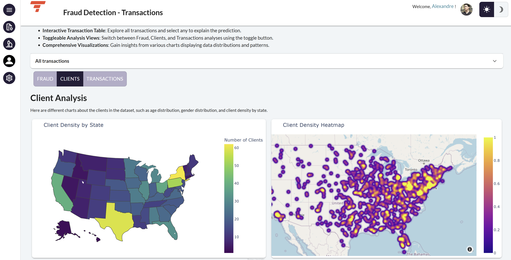
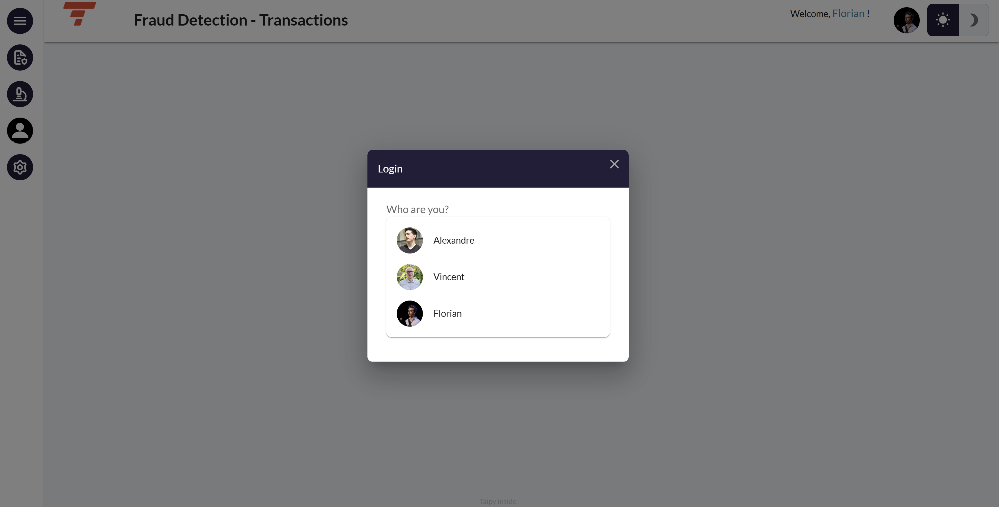
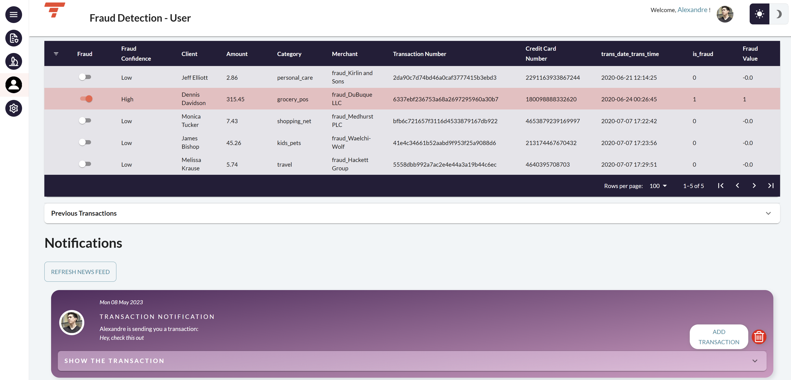
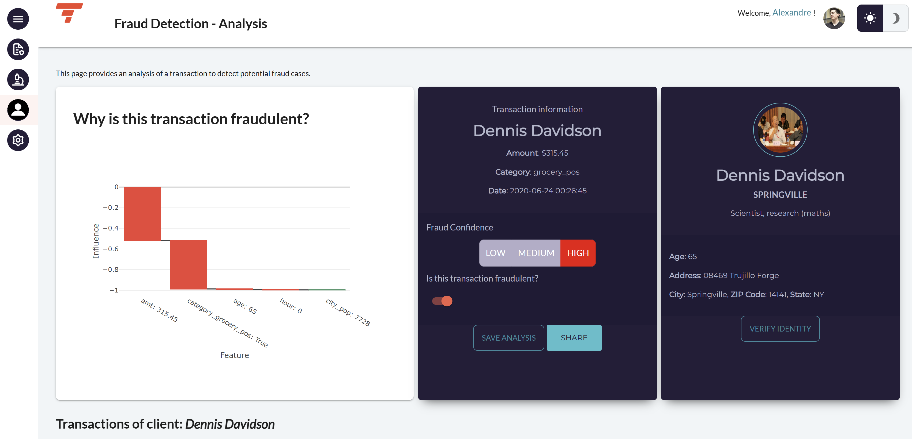
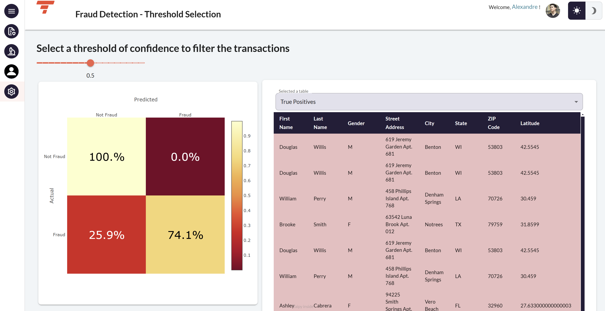

A Taipy Application that analyzes credit card transactions to detect fraud and how users can interact with each other in Taipy.

!!! note "Taipy Enterprise edition"

    Taipy provides robust, business-focused applications tailored for enterprise environments. To
    maintain standards of security and customization, these applications are proprietary like this
    application. If you’re looking for solutions that are immediately deployable and customizable to
    your business needs, we invite you to try them out and contact us for more detailed information.

    [Try it live](https://fraud-detection.taipy.cloud/Transactions){: .tp-btn target='blank' }
    [Contact us](https://taipy.io/book-a-call){: .tp-btn .tp-btn--accent target='blank' }

# Understanding the Application

This application displays a list of credit card transactions. A model estimates whether a transaction 
is fraudulent; this task can be automatically handled by a pipeline. However, some transactions may 
require further human review.

Within the application, you can access various analyses and visualizations of the data:

- List of transactions
- Client information
- Fraud details

{width=90% : .tp-image-border }

This demo includes user management and collaboration features. You need to select one of the 
available users to access the application.

{width=90% : .tp-image-border }

After logging in, you can navigate to your user page to view the transactions assigned to you for 
investigation. You can see both your past transactions and those requiring your attention. Clicking 
on a transaction in the table will select it and navigate you to the Analysis page. 

This page also includes a newsfeed displaying notifications from the application or other users.

{width=90% : .tp-image-border }

The Analysis page presents several pieces of information. The left section explains the model's 
results (providing explanations on the model output), the middle section displays details about the 
transaction, and the right section shows information about the client. Here, you can verify the 
client's identity using a deep learning model.

You can decide whether the transaction is fraudulent or not. If you are unsure, you can share the 
transaction with someone else for further review.

{width=90% : .tp-image-border }

For educational purposes, you can adjust the model's threshold— the output value above which a 
transaction is considered fraudulent. You can select the threshold by examining the displayed 
confusion matrix and reviewing false positive and false negative transactions.

{width=90% : .tp-image-border }