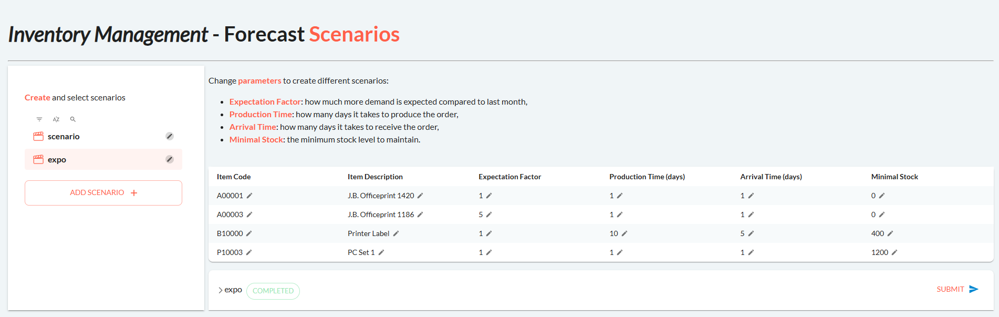
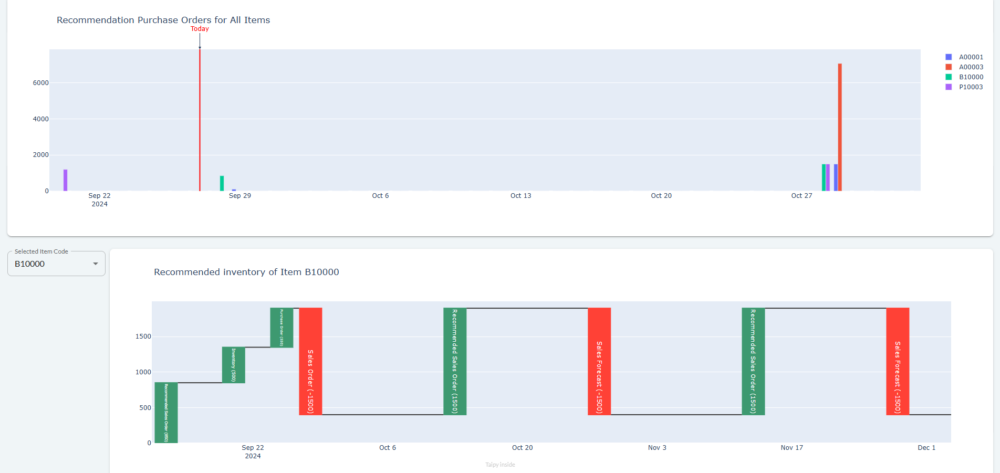

This application is designed to help businesses forecast inventory levels and simulate
purchasing decisions to optimize supply chain operations. The user can input how much demand
he expects for each item, their production and delivery time, and the minimal stock he wants to
have. The application will then calculate the optimal purchasing decisions to satisfy the
demand.

!!! note "Taipy Enterprise edition"

    Taipy provides robust, business-focused applications tailored for enterprise
    environments. To maintain standards of security and customization, these
    applications are proprietary like this application. If you're looking for solutions
    that are immediately deployable and customizable to your business needs, we invite
    you to try them out and contact us for more detailed information.

    [Try it live](https://sap.taipy.cloud/){: .tp-btn target='blank' }
    [Contact us](https://taipy.io/book-a-call){: .tp-btn .tp-btn--accent target='blank' }

# Understanding the Application

The user can input the following parameters for each item:
- Expectation Factor: how much more demand is expected compared to last month,
- Production Time: how many days it takes to produce the order,
- Arrival Time: how many days it takes to receive the order,
- Minimal Stock: the minimum stock level to maintain.

{width=90% : .tp-image-border }

After changing the parameters, the user can start the simulation by pressing the "Submit"
button at the bottom right.

The app will then show the inventory of all items, the recommended purchase orders, and the
simulated inventory levels for each item in plots.

{width=90% : .tp-image-border }