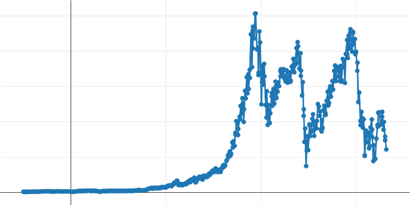
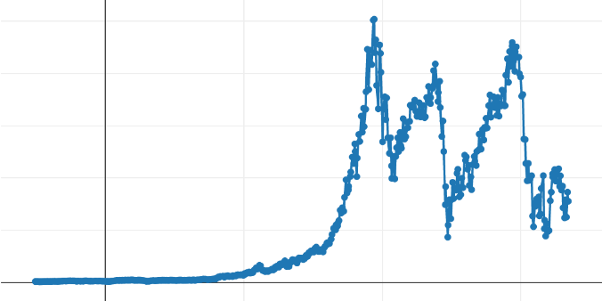
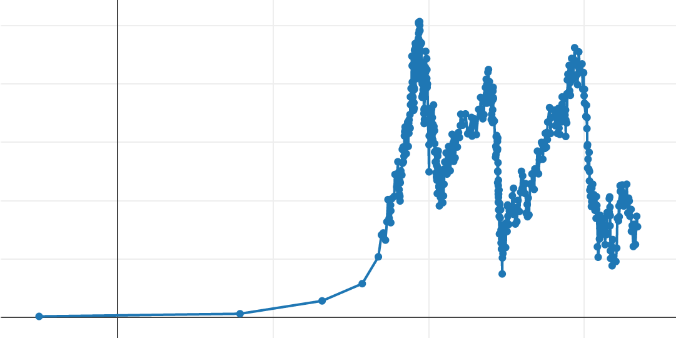

This article aims to show how to minimize the volume of data transiting 
between the application and the GUI client without losing the information.

{width=90% : .tp-image }

When we talk about Data, we refer to large Tabular data with plenty of 
columns and even more rows. If we consider a table (data frame, array, etc.) with 
just 20 columns and 500K rows, generating a graphical view for such a table will 
require over 1 minute on a 10MB/s network!

<center>
10 Mb/s x 8 (bits) x 8 (bytes) * 20 (columns) * 500,000 / 10,000,000 (network 
throughput)

= 

64 sec
</center>

If we manage to reduce "smartly" the number of points that define the shape of the 
plot/curve, we will get:

- A better network bandwidth (see above)
- Less memory used on the client side
- A more meaningful visual (client side) since the plot will involve a much lower 
number of data points.
- A much better user experience: when the end-user clicks on a point to perform 
some action, the graphical component has to seek which points amongst the whole 
dataset have been selected. With a reduced number of points, performance will 
improve drastically. 

This work is wholly disconnected from data transformation, such as compression 
algorithms. It is known that HTTP/1.1 already supports data compression (see the 
Internet Engineering Task Force).

# First level: dealing with curves (2D)

## The basic "algorithm"

The first effort was to transform data (with hundreds of thousands of points or 
more) on the application side to a reduced form plotted as a curve 
visually equivalent to the complete data set. Such reduced form should not exceed the 
maximum resolution of the screen/frame (usually on the horizontal axis).

The process of "reducing" a dataset by eliminating "nonsignificant" points is 
generally referred to as "**decimation**" or "**downsampling**" (or even 
"**subsampling**").

**Important:**  This implementation must allow the end-user to select (graphically) 
a different subset of the displayed curve with an automatic re-run of the 
"decimator algorithm". This will enable the "optimal" display of the data, whatever 
the zoom level is.

We evaluated three different algorithms: 

- The Min-Max algorithm 
- The LTTB algorithm
- The Ramer-Douglas-Peuker algorithm

## Min-Max algorithm

Here is an example of code showing how to use the Min-Max Decimator:

=== "Python"
    ```python
    import yfinance as yf
    from taipy.gui import Gui
    import taipy.gui.builder as tgb
    from taipy.gui.data.decimator import MinMaxDecimator, RDP, LTTB

    df_AAPL = yf.Ticker("AAPL").history(interval="1d", period="max")
    df_AAPL["DATE"] = df_AAPL.index.astype("int64").astype(float)

    NOP = 500
    decimator_instance = MinMaxDecimator(n_out=NOP)

    with tgb.Page() as page:
        tgb.chart("{df_AAPL}", x="DATE", y="Open", decimator="decimator_instance")

    Gui(page).run(title="Decimator")
    ```
=== "Markdown"
    ```python
    import yfinance as yf
    from taipy.gui import Gui
    from taipy.gui.data.decimator import MinMaxDecimator, RDP, LTTB

    df_AAPL = yf.Ticker("AAPL").history(interval="1d", period = "max")
    df_AAPL["DATE"] = df_AAPL.index.astype('int64').astype(float)

    NOP = 500
    decimator_instance = MinMaxDecimator(n_out=NOP)

    page = "<|{df_AAPL}|chart|x=DATE|y=Open|decimator=decimator_instance|>"

    Gui(page).run(title="Decimator")
    ```

Let NOP be the desired number of points to be represented on the client side.

The Min-Max algorithm divides one of the dimensions into as many segments as the 
number of points (NOP).

For each segment, only the original dataset's two extreme points (on the second axis) are kept. Only the extreme values are kept. 

**Performance is excellent.**

## LTTB Algorithm

Here is an example of code showing how to use the LTTB Decimator:

=== "Python"
    ```python
    import yfinance as yf
    from taipy.gui import Gui
    import taipy.gui.builder as tgb
    from taipy.gui.data.decimator import MinMaxDecimator, RDP, LTTB

    df_AAPL = yf.Ticker("AAPL").history(interval="1d", period="max")
    df_AAPL["DATE"] = df_AAPL.index.astype("int64").astype(float)

    NOP = 500
    decimator_instance = LTTB(n_out=NOP)

    with tgb.Page() as page:
        tgb.chart("{df_AAPL}", x="DATE", y="Open", decimator="decimator_instance")

    Gui(page).run(title="Decimator")
    ```
=== "Markdown"
    ```python
    import yfinance as yf
    from taipy.gui import Gui
    from taipy.gui.data.decimator import MinMaxDecimator, RDP, LTTB

    df_AAPL = yf.Ticker("AAPL").history(interval="1d", period="max")
    df_AAPL["DATE"] = df_AAPL.index.astype("int64").astype(float)

    NOP = 500
    decimator_instance = LTTB(n_out=NOP)

    page = "<|{df_AAPL}|chart|x=DATE|y=Open|decimator=decimator_instance|>"

    Gui(page).run(title="Decimator")
    ```

This algorithm is also referred to as "Largest Triangle Three Buckets".

This algorithm forms triangles between adjacent points to decide the relative 
importance of these points. This is a technique used often in cartography. Several 
LTTB implementations are available in Python.

**The performance of this downsampling algorithm is also excellent.**

## The Ramer-Douglas-Peucker Algorithm

Here is an example of code showing how to use the Ramer-Douglas-Peucker Decimator:

=== "Python"
    ```python
    import yfinance as yf
    from taipy.gui import Gui
    import taipy.gui.builder as tgb
    from taipy.gui.data.decimator import MinMaxDecimator, RDP, LTTB

    df_AAPL = yf.Ticker("AAPL").history(interval="1d", period="max")
    df_AAPL["DATE"] = df_AAPL.index.astype("int64").astype(float)

    NOP = 500
    decimator_instance = RDP(n_out=NOP)

    with tgb.Page() as page:
        tgb.chart("{df_AAPL}", x="DATE", y="Open", decimator="decimator_instance")

    Gui(page).run(title="Decimator")
    ```
=== "Markdown"
    ```python
    import yfinance as yf
    from taipy.gui import Gui
    from taipy.gui.data.decimator import MinMaxDecimator, RDP, LTTB

    df_AAPL = yf.Ticker("AAPL").history(interval="1d", period="max")
    df_AAPL["DATE"] = df_AAPL.index.astype("int64").astype(float)

    NOP = 500
    decimator_instance = RDP(n_out=NOP)

    page = "<|{df_AAPL}|chart|x=DATE|y=Open|decimator=decimator_instance|>"

    Gui(page).run(title="Decimator")
    ```

This algorithm uses an entirely different approach. It seeks "important" points in 
the initial/large datasets. These important points are points that, if removed,  
drastically modify the shape of the curve. Another way to put it is that this algorithm 
removes all the points that least alter the shape of the curve.

More information can be found in the seminal paper:

"The Douglas-Peucker Algorithm for Line Simplification". M. Visvalingam & J. D. 
Whyatt, 1990.

Then, an improved version of the algorithm:

"Line generalization by repeated elimination of points". M. Visvalingam & J. 
Whyatt, 1993.

**Performance is not as good as the previous ones, but the quality of the results 
(as demonstrated below) is much better.**

# Second level: dealing with a cloud of points (3D or more)

The previous algorithms are well suited for 2D curves. Still, they are not satisfactory to 
higher dimension visuals. If several data points of the original dataset get 
projected in the same space, they would be removed if the previous 
algorithms were used. Here, the density of the points needs to be represented.  We developed 
a specific algorithm using the following approach:

- We divide the representation space (client side) into a mesh space.
- We minimize the number of points projected in the same cell (of the mesh)
- We ensure that cells with a single point are preserved.

# Results

Presenting here quantitative results, in terms of time or memory saved, when 
applying adaptive optimization algorithms is not very useful. Indeed, the achieved 
performance improvements are closely related to three independent factors: the 
computational power of the application server and its available memory, the network 
bandwidth connecting the server to the client, and the client side itself, where 
the type of browser also comes into play.

On the other hand, a commented visualization of the results obtained can be 
interesting. Here is a typical curve in front of which a data analyst should make 
decisions:

{width=70% : .tp-image-border }

<center>
Initial Curve
</center>

This curve is the result of sampling an anonymous dataset and contains more than 
15,000 points. Its display is performed by a thin line connecting markers at each 
point representing a sample. We chose this dataset because it includes several 
types of progressions that will interest us in judging the results: an area where 
the data progresses slowly, more abrupt variations, and local disturbances. All 
points are represented in the above curve, and we will apply our algorithms to 
these data to judge the visual quality of decimation- how satisfactory the result is 
and at what cost.

For each of the selected algorithms, we decimated the initial dataset by setting 
the number of output points to:

- 500, to visually compare the shapes of the curves and check the approximation's 
satisfaction. This number of curve definition points seems consistent with the 
intended use, occupying between half and one-third of the common horizontal screen 
resolutions.
- 100, to visually account for how the algorithm behaves in different regions of 
the original curve. The degradation is considerable and unacceptable in the context 
of an application.

## Min-Max Algorithm

Here is the result of executing this algorithm on the initial dataset:

{width=70% : .tp-image-border }

<center>
500 points
</center>

{width=70% : .tp-image-border }

<center>
100 points
</center>

We can observe that the overall appearance of the curve is well preserved, as we 
hoped. An obvious drawback is visible on the low-quality curve: the uniform 
segmentation of the axis causes a kind of waste of output points at the beginning 
of the curve, where slight variation is visible.


## LTTB Algorithm

If we execute this algorithm on our dataset, we obtain the following curves:

{width=70% : .tp-image-border }

<center>
500 points
</center>

{width=70% : .tp-image-border }

<center>
100 points
</center>

We can observe (on the low-quality curve) the same problem on the left part of the 
curve. This is not surprising since the surface of the evaluated triangles will 
increase with the abscissa spacing, retaining potentially non-significant points. 
On the other hand, we can see greater precision in the part where values increase 
rapidly (first peak): both local peaks are well preserved, whereas the Min-Max 
eliminated one of the two.

## Ramer-Douglas-Peucker Algorithm

The third algorithm gives the following curves:

{width=70% : .tp-image-border }

<center>
500 points
</center>

{width=70% : .tp-image-border }

<center>
100 points
</center>

This time, it is clear that the left part of the curve (with its low variability) 
is approximated by one or two segments, which seems optimal. This allows "saving" 
additional points to better define the rest of the produced curve. The performance 
of this algorithm is significantly worse than for the two algorithms described 
above but potentially more 'precise' concerning the shape of the curve. Unlike the 
two previous algorithms, in its original form, this algorithm does not start from 
the target number of points to obtain as output. It uses a threshold value 
('epsilon') beyond which we consider that a segment deviates angularly too much 
from the previous one, causing the selection of its destination point to be 
'significant'. 

A modified form of this algorithm is needed if one wants to impose a target number 
of points (like the other algorithms). A pre-processing phase, which is 
more costly, is required.

# Performance

As we have already mentioned, providing absolute performance speed would not be 
very useful, as the execution conditions of our algorithms can vary drastically. 
However, relative performance speed can be helpful. Here they are:

- Min-Max: 1 (reference value)
- LTTB: 10 x
- Ramer-Douglas-Peucker (using the 'epsilon' threshold): 20 x
- Ramer-Douglas-Peucker (using a fixed number of points): 800 x

# Conclusion

Taipy offers the possibility to apply or not a decimation 
algorithm. A developer can choose which algorithm to use and with what parameters. 
If this algorithm is to impact the application's performance too much, it is always 
possible to fine-tune these parameters. 

In the case where the end-user zooms in or out or scrolls the curve, the server 
must calculate the new data entirely represented. It is essential, then, that the 
developer understands the consequences of his choices in terms of:

- manipulated data volume,
- the parameters of each decimation algorithm.