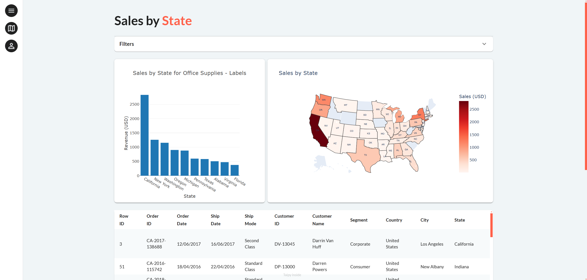

!!! note "Supported Python versions"
    Taipy requires **Python 3.9** or newer.

This tutorial focuses on creating a simple sales dashboard application. You'll learn about visual elements,
interaction, styling, and multi-page applications.

{width=90% .tp-image-border}

This tutorial is also available in video format:

<p align="center">
  <a href="https://youtu.be/4F-266YnTkM" target="_blank">
    
  </a>
</p>

### Installation

Ensure you have Python 3.9 or newer, then install Taipy and Plotly:

```bash
pip install taipy plotly
```

!!! info
    Use `pip install taipy` for the latest stable version. Need help with pip? Check out
    the [installation guide](http://docs.python-guide.org/en/latest/starting/installation/).

The dataset used in this tutorial is the 
[SuperStore Sales dataset](https://www.kaggle.com/datasets/rohitsahoo/sales-forecasting) 
available [here](https://github.com/AlexandreSajus/taipy-course/blob/main/data.csv).

## Tutorial Steps

1. [Visual Elements](step_01/step_01.md)
2. [Styling](step_02/step_02.md)
3. [Charts](step_03/step_03.md)
4. [Multipage](step_04/step_04.md)
