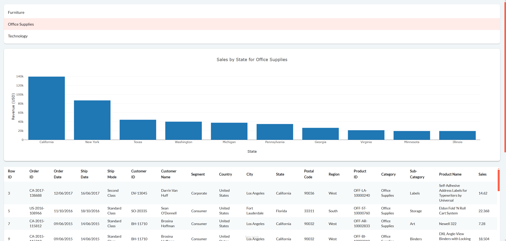

---
hide:
  - toc
---

The full code for this step is available 
[here](https://github.com/AlexandreSajus/taipy-course/blob/main/2_visual_elements/main.py)

Let's start by creating a simple page with 3 components: a selector to select a category of items, 
a bar chart which displays the sales of the top 10 countries for this category and 
a table which displays data for the selected category

{ width=90% : .tp-image-border }

Let's start by importing the necessary libraries:

```python
from taipy.gui import Gui
import taipy.gui.builder as tgb
import pandas as pd
```

We can now start creating the page. We will first add a [selector](../../../../refmans/gui/viselements/generic/selector.md).

```python
with tgb.Page() as page:
    tgb.selector(value="{selected_category}", lov="{categories}", on_change=change_category)
```

Taipy [visual elements](../../../../refmans/gui/viselements/index.md) take many properties. 
Note that dynamic properties use a quote and brackets syntax. We use `value="{selected_category}"` 
to signal to Taipy that `selected_category` should change when the user uses the selector. 
Likewise, if `categories` changes, the selector will get updated with the new values. 

Here, selector needs an associated string variable which will change when a user selects a value, 
a list of values (lov) to choose from, and a callback function to call when the value changes. 
We can define them above:

```python
data = pd.read_csv("data.csv")
selected_category = "Furniture"
categories = list(data["Category"].unique())

def change_category(state):
    # Do nothing for now, we will implement this later
    return None
```

We can now add a chart to display the sales of the top 10 countries for the selected category.

```python
    tgb.chart(
        data="{chart_data}",
        x="State",
        y="Sales",
        type="bar",
        layout="{layout}",
    )
```

Taipy charts have a specific syntax described [here](../../../../refmans/gui/viselements/generic/chart.md). You 
can also directly embed Plotly charts using the `figure` property as we will do in [Step 3](../step_03/step_03.md).

Here we need to provide a Pandas Dataframe with the data to display, the x and y columns to use, the type of chart,
and a layout dictionary with additional properties.

```python
chart_data = (
    data.groupby("State")["Sales"]
    .sum()
    .sort_values(ascending=False)
    .head(10)
    .reset_index()
)

layout = {"yaxis": {"title": "Revenue (USD)"}, "title": "Sales by State"}
```

Lastly, we can add a table to display the data for the selected category.

```python
    tgb.table(data="{data}")
```

We can now run the application using:
  
```python
Gui(page=page).run(title="Sales", dark_mode=False, debug=True)
```

`debug=True` will display a stack trace of the errors if any occur. 
You can also set `use_reloader=True` to automatically reload the page 
when you save changes to the code and `port=XXXX` to change the server port.

The application runs but has no interaction. We need to code the callback function
to update the chart and table when the user selects a category.

```python
def change_category(state):
    state.data = data[data["Category"] == state.selected_category]
    state.chart_data = (
        state.data.groupby("State")["Sales"]
        .sum()
        .sort_values(ascending=False)
        .head(10)
        .reset_index()
    )
    state.layout = {
        "yaxis": {"title": "Revenue (USD)"},
        "title": f"Sales by State for {state.selected_category}",
    }
```

Taipy uses a `state` object to store the variables per client.
The syntax to update a variable will always be `state.variable = new_value`.