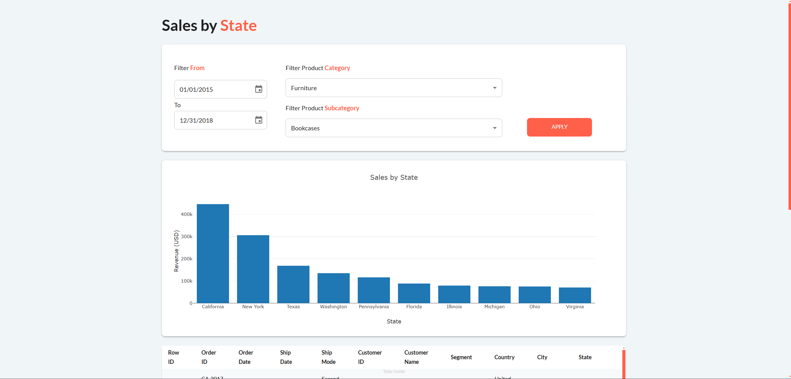
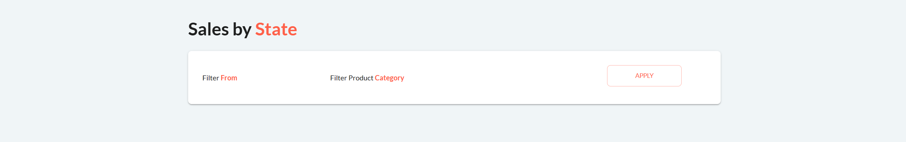
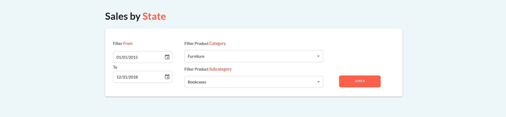

---
hide:
  - toc
---

The full code for this step is available 
[here](https://github.com/AlexandreSajus/taipy-course/tree/main/3_styling)

This step will be about styling the application. We will add more filters, layout the visual element and 
regroup them in parts.

{ width=90% : .tp-image-border }

We can still use the same code as the previous step, but let's recreate the page from scratch:

```python
with tgb.Page() as page:
    with tgb.part(class_name="container"):
        tgb.text("# Sales by **State**", mode="md")
```

[Part](../../../../refmans/gui/viselements/generic/part.md) allows you to group and style visual elements together.
Here, the [container](../../../../userman/gui/styling/stylekit.md) class is a predefined style
that will limit the width of visual elements contained in the part.

[Text](../../../../refmans/gui/viselements/generic/text.md) is a simple text visual element. Here we use the
Markdown (md) mode to display a title and make the word "State". We can also color bold text in orange
by using CSS. Create a new CSS file with the same name as the Python file and add the following code:

```css
strong,
b {
    font-weight: bold;
    color: var(--color-primary);
}
```

Let's now add a new container for the filters:

```python
        with tgb.part(class_name="card"):
            with tgb.layout(columns="1 2 1"):
                with tgb.part():
                    tgb.text("Filter **From**", mode="md")
                with tgb.part():
                    tgb.text("Filter Product **Category**", mode="md")
                with tgb.part(class_name="text-center"):
                    tgb.button(
                        "Apply",
                    )
```

[Card](../../../../userman/gui/styling/stylekit.md) is a predefined style that will regroup visual elements in
a white box. [layout](../../../../refmans/gui/viselements/generic/layout.md) allows you to create columns
for visual elements. Here we create 3 columns with a ratio of 1:2:1, the second column will be twice as wide as the
first and last columns. The contents of each column then needs to be separated in parts.

{ width=90% : .tp-image-border }

We can now add [date selectors](../../../../refmans/gui/viselements/generic/date.md), 
[selectors](../../../../refmans/gui/viselements/generic/selector.md) and a 
[button](../../../../refmans/gui/viselements/generic/button.md) to apply the filters:

```python
        with tgb.part(class_name="card"):
            with tgb.layout(columns="1 2 1"):
                with tgb.part():
                    tgb.text("Filter **From**", mode="md")
                    tgb.date("{start_date}")
                    tgb.text("To")
                    tgb.date("{end_date}")
                with tgb.part():
                    tgb.text("Filter Product **Category**", mode="md")
                    tgb.selector(
                        value="{selected_category}",
                        lov="{categories}",
                        on_change=change_category,
                        dropdown=True,
                    )
                    tgb.text("Filter Product **Subcategory**", mode="md")
                    tgb.selector(
                        value="{selected_subcategory}",
                        lov="{subcategories}",
                        dropdown=True,
                    )
                with tgb.part(class_name="text-center"):
                    tgb.button(
                        "Apply",
                        class_name="plain apply_button",
                        on_action=apply_changes,
                    )
```

You'll notice we converted our selectors to dropdowns by setting the `dropdown` property to `True`.
We also applied styling to the button: `plain` is a predefined style that colors the button in orange. 
Predefined styles are available in visual elements documentation. 
Check out the styling part of [button](../../../../refmans/gui/viselements/generic/button.md/).
`apply_button` is a custom style that we can add using our CSS file:

```css
.apply_button {
    margin-top: 158px;
}
```

This will add a margin to the top of the button to align it with the filters.
We can also add properties to all Taipy buttons by applying properties to the `taipy-button` class
(You can find these class names by inspecting the page on a visual element)

```css
.taipy-button {
    width: 60%
}
```

{ width=90% : .tp-image-border }

We can now add the chart and the table:

```python
        tgb.html("br")
        tgb.chart(
            data="{chart_data}",
            x="State",
            y="Sales",
            type="bar",
            layout="{layout}",
        )
        tgb.html("br")
        tgb.table(data="{data}")

Gui(page=page).run(title="Sales", dark_mode=False, debug=True)

```

We use `tgb.html("br")` to add a line break and create space between elements.

The last thing we need is to initialize the new variables and create the callback
function to apply the filter:

```python
data = pd.read_csv("data.csv")
chart_data = (
    data.groupby("State")["Sales"]
    .sum()
    .sort_values(ascending=False)
    .head(10)
    .reset_index()
)

start_date = "2015-01-01"
start_date = pd.to_datetime(start_date)
end_date = "2018-12-31"
end_date = pd.to_datetime(end_date)

categories = list(data["Category"].unique())
selected_category = "Furniture"

selected_subcategory = "Bookcases"
subcategories = list(
    data[data["Category"] == selected_category]["Sub-Category"].unique()
)

layout = {"yaxis": {"title": "Revenue (USD)"}, "title": "Sales by State"}


def change_category(state):
    state.subcategories = list(
        data[data["Category"] == state.selected_category]["Sub-Category"].unique()
    )
    state.selected_subcategory = state.subcategories[0]


def apply_changes(state):
    state.data = data[
        (
            pd.to_datetime(data["Order Date"], format="%d/%m/%Y")
            >= pd.to_datetime(state.start_date)
        )
        & (
            pd.to_datetime(data["Order Date"], format="%d/%m/%Y")
            <= pd.to_datetime(state.end_date)
        )
    ]
    state.data = state.data[state.data["Category"] == state.selected_category]
    state.data = state.data[state.data["Sub-Category"] == state.selected_subcategory]
    state.chart_data = (
        state.data.groupby("State")["Sales"]
        .sum()
        .sort_values(ascending=False)
        .head(10)
        .reset_index()
    )
    state.layout = {
        "yaxis": {"title": "Revenue (USD)"},
        "title": f"Sales by State for {state.selected_category} - {state.selected_subcategory}",
    }
```