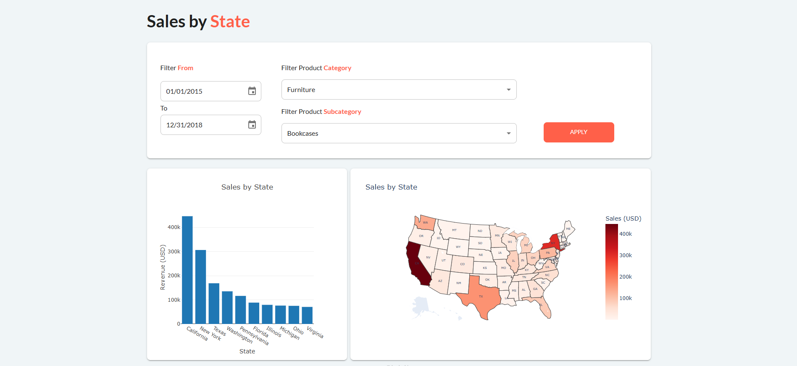
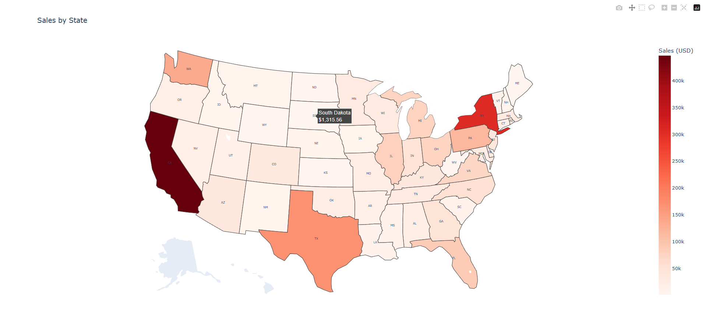

---
hide:
  - toc
---

The full code for this step is available 
[here](https://github.com/AlexandreSajus/taipy-course/tree/main/4_charts)

In this part we will embed a Plotly map figure in our application.

{ width=90% : .tp-image-border }

For this purpose, we will use the `generate_map` function defined 
[here](https://github.com/AlexandreSajus/taipy-course/blob/main/4_charts/chart.py)
to return a Plotly map figure.

{ width=50% : .tp-image-border }

Using the same code as the previous steps, we can import the function and initialize the chart:

```python
from chart import generate_map

data = pd.read_csv("data.csv")
map_fig = generate_map(data)
```

We can now add the map to the page by replacing our previous chart and table with:

```python
        tgb.html("br")
        with tgb.layout(columns="2 3"):
            tgb.chart(
                data="{chart_data}",
                x="State",
                y="Sales",
                type="bar",
                layout="{layout}",
            )
            tgb.chart(figure="{map_fig}")
        tgb.html("br")
        tgb.table(data="{data}")
```

We should now update the callback function to refresh the map when filters are applied:

```python
def apply_changes(state):
    state.data = data[
        (
            pd.to_datetime(data["Order Date"], format="%d/%m/%Y")
            >= pd.to_datetime(state.start_date)
        )
        & (
            pd.to_datetime(data["Order Date"], format="%d/%m/%Y")
            <= pd.to_datetime(state.end_date)
        )
    ]
    state.data = state.data[state.data["Category"] == state.selected_category]
    state.data = state.data[state.data["Sub-Category"] == state.selected_subcategory]
    state.chart_data = (
        state.data.groupby("State")["Sales"]
        .sum()
        .sort_values(ascending=False)
        .head(10)
        .reset_index()
    )
    state.layout = {
        "yaxis": {"title": "Revenue (USD)"},
        "title": f"Sales by State for {state.selected_category} - {state.selected_subcategory}",
    }
    state.map_fig = generate_map(state.data)
```