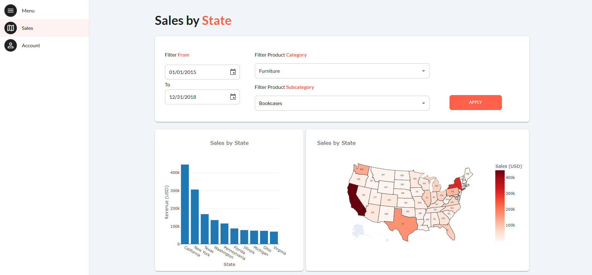

---
hide:
  - toc
---

The full code for this step is available 
[here](https://github.com/AlexandreSajus/taipy-course/tree/main/5_multipage)

In this part we will add a second page to our application and a sidebar menu to navigate between pages.

{ width=90% : .tp-image-border }

Using the same code as the previous steps, let's add a root page which will contain the sidebar menu
and appear on all pages:

```python
from taipy.gui import Gui, Icon, navigate

with tgb.Page() as root_page:
    tgb.menu(
        label="Menu",
        lov=[
            ("page1", Icon("images/map.png", "Sales")),
            ("page2", Icon("images/person.png", "Account")),
        ],
        on_action=menu_option_selected,
    )
```

Here we use the [menu](../../../../refmans/gui/viselements/generic/menu.md) visual element to create a sidebar menu.
`menu` take a label which will be displayed at the top of the menu, a list of values (lov) which need the following format:
`(page_url, Icon(icon_image_path, page_name))`, and a callback function to call when an option is selected.

The images used are available [here](https://github.com/AlexandreSajus/taipy-course/tree/main/5_multipage/images)

Let's add a second page:

```python
with tgb.Page() as page_2:
    tgb.text("# Account **Management**", mode="md")
    tgb.button("Logout", class_name="plain")
```

And run the application:

```python
pages = {"/": root_page, "page1": page, "page2": page_2}

Gui(pages=pages).run(title="Sales", dark_mode=False, debug=True)
```

For multipage applications, we use `pages` instead of `page` as the argument of the `Gui` class.

`pages` is a dictionary where the key is the page URL and the value is the page object.

We now need to create a callback function to navigate between pages:

```python
def menu_option_selected(state, action, info):
    page = info["args"][0]
    navigate(state, to=page)
```

The callback signature for `menu` visual element is described [here](../../../../refmans/gui/viselements/generic/menu.md).
Here we extract the page URL from the `info` dictionary and use the `navigate` function to change the page.

Lastly, we can add some CSS to resize the images and make the login button smaller:

```css
.login-button {
    width: 20% !important;
}

.MuiAvatar-img {
    width: 70%;
    height: 70%;
}
```