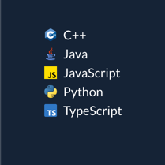
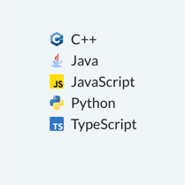

In the previous section, we discussed creating dynamic elements. In Taipy GUI, lists can be bound to Python variables or
expressions, allowing real-time updates in the UI. Custom elements that handle lists should define their properties using
the `PropertyType^` class to specify the format of list values. This setup supports multidimensional data binding, ensuring
that any changes to the list automatically refresh the display.

# Using list of values

In this section, we'll design a visual component that represents a list of programming languages. Each language will be
displayed with its name and an icon.

This dynamic component will take a property containing a list of values and render them as a list.
When a Python variable is bound to this property,
any updates to the variable will instantly reflect in the displayed list, enabling real-time synchronization.

## Declaring a dynamic element {data-source="gui:doc/extension/example_library/example_library.py#L45"}

Starting from the code mentioned above, here is how you would declare this new element:
```python title="example_library.py"
from taipy.gui.extension import Element, ElementLibrary, ElementProperty, PropertyType

class ExampleLibrary(ElementLibrary):
    def __init__(self) -> None:
        # Initialize the set of visual elements for this extension library
        self.elements = {
            "visual_label_list": Element(
                "lov",
                {
                    "lov": ElementProperty(PropertyType.lov),
                    "sort": ElementProperty(PropertyType.string),
                },
                # The name of the React component (VisualLabelList) that implements this custom
                # element, exported as LabeledItemList in front-end/src/index.ts
                react_component="VisualLabelList",
            )
        }
```
The detailed explanation of the code is as follows:

- The *visual_label_list* element includes two properties: *lov* and *sort*.
- The *lov* property has the type `PropertyType.lov^`, meaning it holds a list of values and is dynamic.
- The *sort* property has the type `PropertyType.string^`, meaning it holds a string value. Because this property is
  static, it is not updated automatically should the bound variable be changed.
- *get_name()* and *get_elements()* remain the same as in the previous stages of building the extension library example.

## Creating the React component {data-source="gui:doc/extension/example_library/front-end/src/VisualLabelList.tsx"}

The React component for the *visual_label_list* element is defined as follows:
```tsx title="VisualLabelList.tsx" linenums="1"
import React, { useMemo } from "react";
import { LoV, useLovListMemo } from "taipy-gui";

interface VisualLabelListProps {
    lov?: LoV;
    defaultLov?: string;
    sort?: "asc" | "desc";
}

const styles = {
    listItem: {
        display: "flex",
        alignItems: "center",
    },
    image: {
        marginRight: "8px",
        width: "1em",
        height: "1em",
    },
};

const VisualLabelList: React.FC<VisualLabelListProps> = ({ lov, defaultLov = "", sort }) => {
    const lovList = useLovListMemo(lov, defaultLov);

    const sortedLovList = useMemo(() => {
        if (sort) {
            return lovList.slice().sort((a, b) => {
                return sort === "asc" ? a.id.localeCompare(b.id) : b.id.localeCompare(a.id);
            });
        }
        return lovList;
    }, [lovList, sort]);

    return (
        <div>
            <ul>
                {sortedLovList.map((item, index) => (
                    <li key={index} style={styles.listItem}>
                        {typeof item.item === "string" ? null : (
                            
                        )}
                        {item.id}
                    </li>
                ))}
            </ul>
        </div>
    );
};

export default VisualLabelList;
```

The detailed explanation of the code is as follows:

- The *lov* property, defined as `PropertyType.lov^`, expects a value of type
  [`LoV`](../../../../refmans/reference_guiext/type-aliases/LoV.md).
- Using Taipy GUI’s [`useLovListMemo()`](../../../../refmans/reference_guiext/functions/useLovListMemo.md) hook, we
  create a memoized list of values based on this *lov* property, efficiently managing the component’s list of values.
- To enhance this list, we can apply sorting using the *sort* property, which accepts either “asc” for ascending or
  “desc” for descending order. Since *sort* is static, a default value is unnecessary. When set to "asc" or "desc," the
  list is sorted accordingly. If *sort* is not defined in the script, the list displays values in their original order.

## Exporting the React component {data-source="gui:doc/extension/example_library/front-end/src/index.ts"}

When the component is entirely defined, it must be exported by the library's JavaScript bundle.
This is done by adding the export directive in the file *<project dir>/<package dir>front-end/src/index.ts*.

```js title="index.ts"
import VisualLabelList from "./VisualLabelList";

export { VisualLabelList };
```

## Using the element {data-source="gui:doc/extension/visual_label_list.py"}

To use the *visual_label_list* element in a Python script, you can follow the example below:
```py title="List of items"
languages = [
    ["Python", Icon("images/python.png", "Python logo")],
    ["JavaScript", Icon("images/javascript.png", "JavaScript logo")],
    ["TypeScript", Icon("images/typescript.png", "TypeScript logo")],
    ["Java", Icon("images/java.png", "Java logo")],
    ["C++", Icon("images/cpp.png", "C++ logo")],
]

page = """
<|{languages}|example.visual_label_list|sort=asc|>
"""
```

In this example, the *languages* list contains a [`list of value`](../../binding.md#list-of-values),
each with a name and an icon. The *page* variable contains a string that uses the *visual_label_list* element to display
the list of languages in ascending order. The *sort* property is set to “asc” to sort the list alphabetically by
language name. When the page is rendered, the list will display the languages in the specified order.

By following these steps, you can create a dynamic element that displays a list of values and updates in real time as
the underlying data changes. This approach allows you to build custom elements that can manage and display collections
of data, providing a more interactive and responsive user interface.

When you run this application, the page displays the element like this:

<figure>
    
    
    <figcaption>Visual labeled list</figcaption>
</figure>

