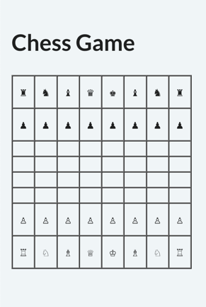

# Using tabular data

In this section, we will expand the custom element library, initially created in the Static Elements section, by
adding a dynamic custom element.

This dynamic element will accept a property containing tabular data and display it within a table. When a Python
variable is bound to this property, updates to the variable will immediately reflect in the table content shown on
the front end, ensuring real-time synchronization.

## Declaring a dynamic element {data-source="gui:doc/extension/example_library/example_library.py#L36"}

```py
from taipy.gui.extension import Element, ElementLibrary, ElementProperty, PropertyType

class ExampleLibrary(ElementLibrary):
    def __init__(self) -> None:
        # Initialize the set of visual elements for this extension library
        self.elements = {
            "game_table": Element(
                "data",
                {
                    "data": ElementProperty(PropertyType.data),
                },
                # The name of the React component (GameTable) that implements this custom
                # element, exported as GameTable in front-end/src/index.ts
                # react_component="GameTable",
            ),
        }
    def get_name(self) -> str:
        return "example"

    def get_elements(self) -> dict:
        return self.elements

    def get_scripts(self) -> list[str]:
        # Only one JavaScript bundle for this library.
        return ["front-end/dist/exampleLibrary.js"]
```

The detailed explanation of the code is as follows:

- The `game_table` element includes a single property: `data`.
- The `data` property has the type `PropertyType.data`, meaning it holds a data value and is dynamic.
- The `get_name` method in the `ExampleLibrary` class returns the name of the library as a string. This name is used
  to identify the library within the Taipy GUI framework.
- The `get_elements` method in the `ExampleLibrary` class returns a dictionary of elements that are part of this
  library. Each element is defined with its properties and associated React component.

## Creating the React component {data-source="gui:doc/extension/example_library/front-end/src/GameTable.tsx"}

The React component for the `game_table` element is defined as follows:

```jsx
import React, { useEffect, useMemo, useState } from "react";
import {
    createRequestDataUpdateAction,
    useDispatch,
    useDispatchRequestUpdateOnFirstRender,
    useModule,
    TaipyDynamicProps,
    TableValueType,
    RowType,
    RowValue,
} from "taipy-gui";

interface GameTableProps extends TaipyDynamicProps {
    data: TableValueType;
}

const pageKey = "no-page-key";

const GameTable = (props: GameTableProps) => {
    const { data, updateVarName = "", updateVars = "", id } = props;
    const [value, setValue] = useState<Record<string, Array<RowValue>>>({});
    const dispatch = useDispatch();
    const module = useModule();
    const refresh = data?.__taipy_refresh !== undefined;
    useDispatchRequestUpdateOnFirstRender(dispatch, id, module, updateVars);

    const colsOrder = useMemo(() => {
        return Object.keys(value);
    }, [value]);

    const rows = useMemo(() => {
        const rows: RowType[] = [];
        if (value) {
            Object.entries(value).forEach(([col, colValues]) => {
                    colValues.forEach((val, idx) => {
                        rows[idx] = rows[idx] || {};
                        rows[idx][col] = val;
                    });
            });
        }
        return rows;
    }, [value]);

    useEffect(() => {
        if (refresh || !data || data[pageKey] === undefined) {
            dispatch(
                createRequestDataUpdateAction(
                    updateVarName,
                    id,
                    module,
                    colsOrder,
                    pageKey,
                    {},
                    true,
                    "ExampleLibrary",
                ),
            );
        } else {
            setValue(data[pageKey]);
        }
    }, [refresh, data, colsOrder, updateVarName, id, dispatch, module]);

    return (
        <div>
            <table border={1} cellPadding={10} cellSpacing={0}>
                <tbody>
                    {rows.map((row, index) => (
                        <tr key={"row" + index}>
                            {colsOrder.map((col, cidx) => (
                                <td key={"val" + index + "-" + cidx}>{row[col]}</td>
                            ))}
                        </tr>
                    ))}
                </tbody>
            </table>
        </div>
    );
};

export default GameTable;
```

The detailed explanation of the code is as follows:

- We use the [useDispatch](https://docs.taipy.io/en/latest/refmans/reference_guiext/functions/useDispatch/) hook to
  dispatch actions to the store and initiate backend communications.
- Additionally, the [useModule](https://docs.taipy.io/en/latest/refmans/reference_guiext/functions/useModule/) hook
  retrieves the page module, enabling correct execution of backend functions.
- To request an update for every dynamic property of an element on initial render, we use the
  [useDispatchRequestUpdateOnFirstRender](https://docs.taipy.io/en/latest/refmans/reference_guiext/functions/useDispatchRequestUpdateOnFirstRender/#function-usedispatchrequestupdateonfirstrender)
  hook provided by the Taipy GUI Extension API. This hook takes five parameters:
  - `dispatch`: The React dispatcher associated with the context.
  - `id`: The identifier of the element.
  - `context`: The execution context.
  - `updateVars`: The content of the `updateVars` property.
- We also dispatch the
  [createRequestDataUpdateAction](https://docs.taipy.io/en/latest/refmans/reference_guiext/functions/createRequestUpdateAction/)
  hook to create a request data update action, which updates the context by invoking the
  [get_data](https://docs.taipy.io/en/latest/refmans/reference/pkg_taipy/pkg_gui/pkg_extension/ElementLibrary/#taipy.gui.extension.ElementLibrary.get_data)
  method of the backend library. This invocation triggers an update of front-end elements holding the data.

The [createRequestDataUpdateAction](https://docs.taipy.io/en/latest/refmans/reference_guiext/functions/createRequestUpdateAction/)
hook accepts eight parameters:

- `name`: The name of the variable containing the requested data, as received in the property.
- `id`: The identifier of the visual element.
- `context`: The execution context.
- `columns`: The list of columns required by the element emitting this action.
- `pageKey`: The unique identifier for the data received from this action.
- `payload`: The payload, specific to the component type (e.g., table, chart).
- `allData`: A flag indicating if all data is requested.
- `library`: The name of the extension library.

## Exporting the React component {data-source="gui:doc/extension/example_library/front-end/src/index.ts"}

When the component is entirely defined, it must be exported by the JavaScript library.
This is done by adding the export directive in the file `<project dir>/<package dir>/front-end/src/index.ts`.

```js
import GameTable from "./GameTable";

export { GameTable };
```

## Using the element in the application {data-source="gui:doc/extension/table_chess_game.py"}

In the example below, we use the `game_table` element to display a chess game board. The board is represented as a
two-dimensional list of strings, where each string represents a chess piece. The board is displayed in a table format
using the `game_table` element.

```py
from example_library import ExampleLibrary

from taipy.gui import Gui

data = [
    ["♖", "♘", "♗", "♕", "♔", "♗", "♘", "♖"],
    ["♙", "♙", "♙", "♙", "♙", "♙", "♙", "♙"],
    ["", "", "", "", "", "", "", ""],
    ["", "", "", "", "", "", "", ""],
    ["", "", "", "", "", "", "", ""],
    ["", "", "", "", "", "", "", ""],
    ["♟", "♟", "♟", "♟", "♟", "♟", "♟", "♟"],
    ["♜", "♞", "♝", "♛", "♚", "♝", "♞", "♜"]
]

page = """
## Chess Game
<|{data}|example.game_table|>
"""

if __name__ == "__main__":
    Gui(page, libraries=[ExampleLibrary()]).run(title="Chess Game")
```

When you run this application, the page displays the element like this:

<figure>
    
    
    <figcaption>Chess game</figcaption>
</figure>
